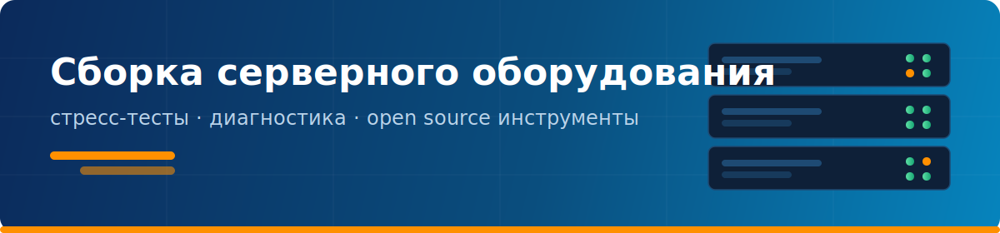

  

## Привет! 👋

Я занимаюсь **сборкой, апгрейдом и обслуживанием серверного оборудования** —
подбираю конфигурации под задачи, прожигаю железо перед выдачей и отдаю клиенту
машину с понятным отчётом о тестировании, а не «на словах всё работает».

### 🔧 Чем занимаюсь

- 🖥️ **Сборка и апгрейд серверов** — HPE ProLiant, Supermicro, Dell PowerEdge; стоечные 1U–4U, одно- и многопроцессорные конфигурации (×2/×4 Xeon)
- 🧪 **Прожиг и диагностика перед выдачей** — стресс-тесты CPU, memtest-проверка ОЗУ, отчёт клиенту одним экраном
- 📦 **Подбор конфигураций** — Intel Xeon Scalable, ECC DDR4/DDR5, RAID-массивы, удалённое управление iLO/IPMI
- 🛠️ **Open source инструменты для сервиса** — то, чего не хватало в работе, пишу сам и выкладываю

### ⚙️ Железо и стек

  
  
  
  
  

  
  
  
  
  

---

## 🚀 Мой проект: SERVER GATE — Stress Test

Открытый инструмент прожига серверов и ПК: **7 CPU-тестов**, **12 тестов ОЗУ в стиле
memtest86**, определение многопроцессорных конфигураций, паспорт железа как в AIDA
и **отчёт в одно окно** — клиент видит результат на одном скриншоте.
Есть **загрузочный Live ISO для Ventoy** (BIOS + UEFI, Secure Boot friendly) — тест
сервера без установки ОС.

  

  
  

  
  
  

---

  🌐 <a href="https://servergate.ru">servergate.ru</a> · 💬 Вопросы по железу и инструментам — в
  <a href="https://github.com/xauskis/servergate-stress-test/issues">Issues</a>

  <i>Если мои инструменты пригодились — ⭐ звезда репозиторию очень помогает проекту.</i>

